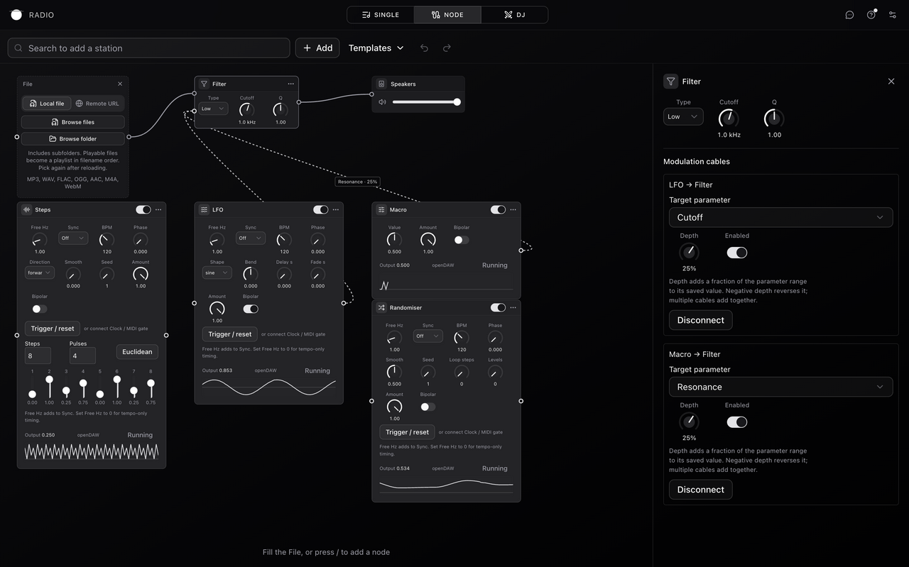

# Node parameter modulation

Read this when changing control sources, parameter assignments, their playback
bridge, or modulation editing. Availability comes from the catalogue; defaults
and persisted controls come from `modulation-schema.ts`.

## Acceptance status

This is a working prototype with real playback integration and one cable-based
UX. Final UX acceptance, physical MIDI/microphone checks, WebKit/touch and
listening-quality checks are still pending. Automated validation and the browser
smoke checks support code review; they do not establish release readiness.

## Try the prototype

1. In Node mode, use **Add → Modulators**. Each module has a live output trace;
   **Run** unlocks the browser audio context when needed.
2. Connect a control output to an audio source or FX **Parameter** input. Click
   the cable label, or inspect either module, to select the numeric target,
   signed depth, enable state, or disconnect. Completion: the target moves while
   its saved knob value stays fixed; disabling the cable restores that value.
3. Try LFO, Steps, Randomiser and Macro first. Steps has editable bars,
   1–64 steps and a Euclidean fill. Randomiser has seed, smoothing, loop and
   quantization. Timed sources add free Hz to their selected BPM sync rate;
   use zero free Hz for tempo-only timing. Their clock runs independently of
   source playback.
4. For Follower, branch an audio cable into **In**. It detects the
   signal at the connected output, including that cable's gain/mute. Multiple
   inputs sum before detection. Completion: its trace follows the cabled signal.
5. Hold the ADSR or Multi-stage envelope gate button, then release it. A Clock or
   MIDI gate cable supplies the same gate. Curve supports editable points/bends,
   looping or a triggered one-shot; Multi-stage envelope has eight points and
   an optional sustain point. LFO adds delayed fade-in and reset; Shaped LFO
   exposes Tidal slope/symmetry. Slew smooths an incoming control cable.
6. Enable MIDI in existing settings and connect hardware from MIDI input. It
   offers CC, gate, velocity and key modes with channels numbered 0–15. Latest
   held note wins; releasing it falls back to an earlier held note. Existing
   MIDI learn can also drive numeric module controls, including Macro value.

## Runtime boundaries

- Sources run on AudioWorklet clocks. Readouts and target updates cross to the
  main thread at about 30 Hz. Native AudioParams use a 10 ms smoothing target;
  target modulation remains control-rate.
- LFO, Steps, Randomiser and Macro prefer the existing official FX Project's
  `project.api.modulation.createLfo/createSteps/createRandom/createMacro`.
  `modulation-native.ts` maps their settings to SDK box fields, subscribes to
  public `liveStreamReceiver.subscribeFloats` output, and deletes only the boxes
  it owns. The shared engine is explicitly awakened. Worklet ticks also call
  the receiver's public `dispatch()` so updates do not rely on animation frames
  in a background tab. No second Project or engine is created.
- Each timed Node retains its own BPM. The adapter feeds the sum of free Hz and
  BPM-sync Hz to the native integrated free clock, keeping the shared FX
  Project's tempo intact. Native telemetry already includes amount and
  polarity; the bridge must not apply them again.
- Incoming gate/reset cables, manual reset, LFO delay/fade and a custom seed for
  Steps random order use DSP extensions because the native globals do not
  expose those controls. Manual reset keeps that source on DSP for its runtime
  lifetime. Unsupported native environments also use DSP. The output badge
  identifies the active backend; inspect its title for native startup failures.
- Other sources reuse openDAW `Adsr`, `RMS`, `Smooth` and `TidalComputer` where
  applicable. Follower taps, envelopes, curve playback, Clock, MIDI and fallback
  globals are Radio adapters. Curve segments use openDAW `Curve.normalizedAt`.
  See the [source audit](../../../../../../../docs/research/opendaw-parameter-modulation-2026-10-06.md)
  when comparing additional upstream capabilities.
- Each cable adds `output × depth` in normalized target space; contributions
  sum and clamp. openDAW `ValueMapping.linear/exponential` supplies normalized
  target conversion, including logarithmic Filter cutoff. Target discovery uses
  existing numeric FX parameter metadata plus native Filter/Pan/Gain and source
  pan/trim. Structural switches and source transport controls stay authored.
- `modulation-parameters.ts` creates an ephemeral graph for lane or explicit
  graph routing.
  `node-playback.ts` applies transient values without graph commits, persisted
  writes or normal FX reconciliation. Official runtime field transactions
  bypass editing history; compatibility updates reuse existing processors.
  Removal, disable and Node deactivation restore authored values.
- The target bridge does not use `project.api.modulation.assign`: one patch can
  target Web Audio strips, compatibility FX and official openDAW devices, and
  contributions must sum consistently across them. Native source generation
  does not make these assignments native or audio-rate.
- Validation bounds the patch to 32 control nodes, eight followers and the
  source/playing budgets. Merge sums control inputs and Split fans them out;
  passive routers do not count as modulation sources. Control cycles are refused.
  Audio into a follower is a detector tap and gives it no managed audio lane.

## First-class UI integrations

- React Flow owns ports, connection gestures, hit testing and cable paths.
  Control cables use `BaseEdge`, `getBezierPath` and `EdgeLabelRenderer` through
  `flow-adapter.ts`; ports use `Handle`, `useNodeConnections`, `useConnection`
  and `useUpdateNodeInternals` through the existing port provider. Connection
  validation remains centralized in React Flow's `isValidConnection` callback.
- Shared UI components supply Radix Slider, Select, Switch, Popover and Button
  behavior. Step bars use vertical Slider with keyboard/wheel support. Cable
  targets use Select. Module controls reuse the existing Knob and release/undo
  helpers. Custom SVG only draws the curve and live trace; curve values remain
  reachable from shared keyboard controls.
- The controlled React Flow graph still comes from the existing TanStack Store
  and Zod document schema. React Flow `useNodesState` would add a second document
  state; `addEdge` deduplicates matching handles, whereas multiple parameter
  assignments between the same two nodes are valid here. Domain graph commits
  retain the existing history, persistence and assignment semantics.

Verified against installed SDK exports and upstream documentation:
[openDAW modulation API](https://github.com/andremichelle/openDAW/blob/88113f892cea2fa9495289a9c166b6fe0f93ce69/packages/studio/core/src/project/ProjectModulation.ts),
[native telemetry](https://github.com/andremichelle/openDAW/blob/88113f892cea2fa9495289a9c166b6fe0f93ce69/packages/app/studio/src/ui/modulation/editors/ShapeDisplay.tsx),
[React Flow edge labels](https://reactflow.dev/api-reference/components/edge-label-renderer),
[React Flow handles](https://reactflow.dev/api-reference/components/handle),
[Radix Slider](https://www.radix-ui.com/primitives/docs/components/slider).

## Change and verify

Native globals belong in `src/lib/node-graph/modulation-native.ts`; other source
changes belong in `modulation-dsp.ts`. Worklet messaging
and audio taps belong in `modulation-runtime.ts`. Target changes belong in
`modulation-parameters.ts` and the audio manager's transient methods. UI controls
live in `control-node.tsx` and `modulation-editors.tsx`; cable controls stay in
`modulation-cables.tsx` so the inspector keeps React Flow lazy.

Restart the dev server after changing worklet code: its separate bundle builds
at startup. Completion requires DSP/routing tests, the radio suite, workspace
check/typecheck, and the radio production build's lazy-chunk guard. In the browser,
verify a live target, restoration, and unchanged authored values/history.
Physical MIDI, microphone capture, WebKit/touch and listening quality remain
device acceptance checks.
