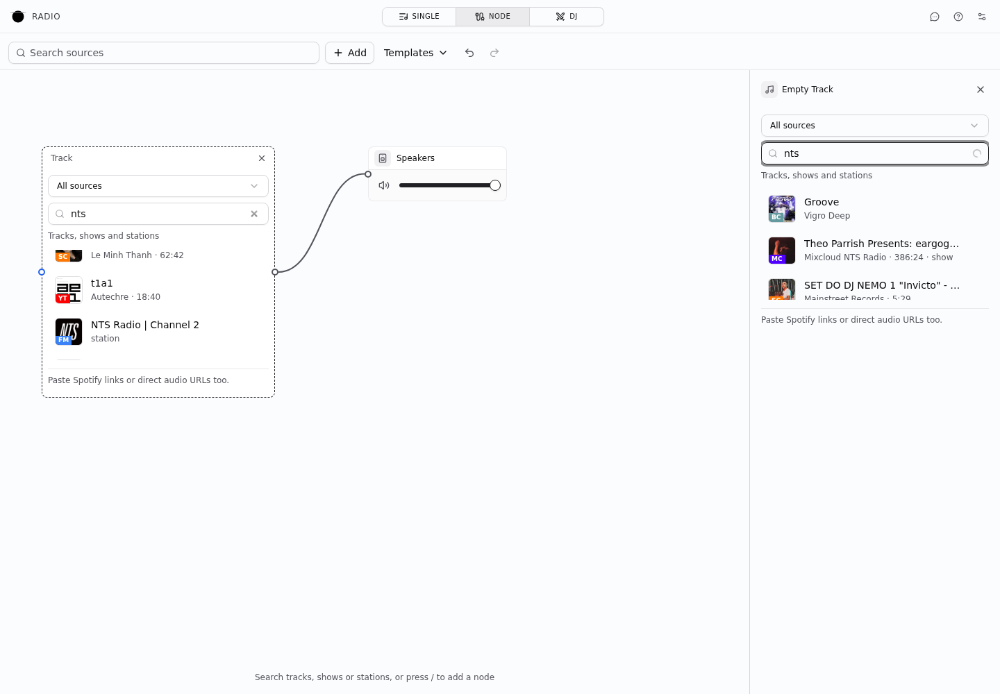
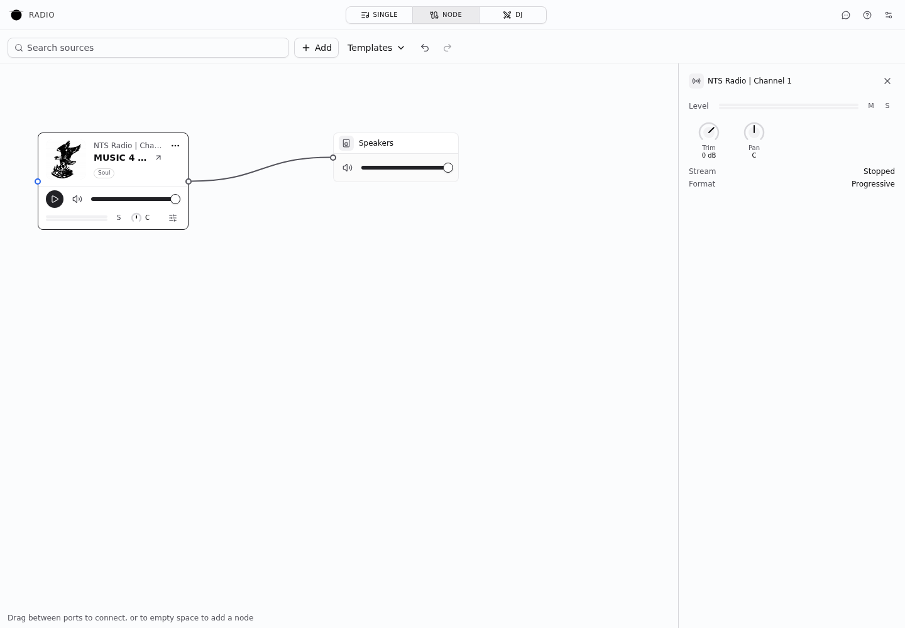
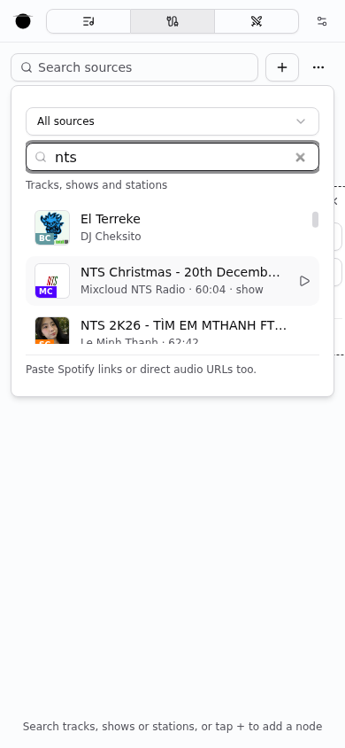
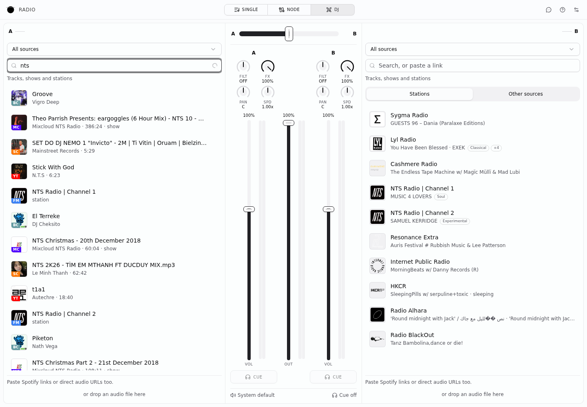
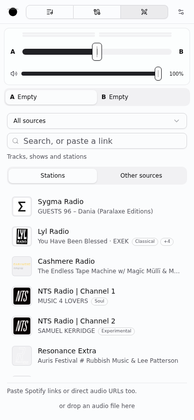

# Node mode UX validation, 10 October 2026

The pass preserves the existing typography, semantic colors, canvas layout and
inspector. It gives setup guidance one place to live, keeps one mute per source
surface, and describes playback separately from microphone permission.

| State | Before | After |
| --- | --- | --- |
| Input setup | Device hint repeats picker; channels appear before a device is selected | Picker leads; channels appear after selection |
| Input playback | Two controls say mute; badge says Off | Pause input changes playback; one volume mute; Starting / Live / Paused status |
| Routing | Rack says Direct even when effects intervene | Rack names the destination without implying a direct path |
| Modulation | Repeated engine label, timing paragraph and Running button | Engine on hover; expandable timing help; Running is status text |
| Templates | Replacing the patch is implicit | Replacement is stated before choosing a template |

## Screenshots

Chromium at 1440 × 1000, using the same microphone/LFO patch. The microphone is
Chromium's simulated device; these screenshots do not verify physical hardware.

| Before | After |
| --- | --- |
|  |  |
|  |  |

The 390 × 844 inspector uses the full drawer width, with one heading and one mute.

## Verification

- Chromium: Go live → Pause input → Go live, template replacement note,
  desktop canvas and phone inspector; no page errors or document overflow.
- Checked input setup in light and dark themes.
- Regression cases cover microphone-aware onboarding, loading guidance,
  Starting status, duplicate permission errors, and deferred channel controls.
- Audio routing, permission acquisition, capture lifetime and persistence are
  unchanged. Pausing input audio does not promise to release microphone access.

## Unified discovery and inspector follow-up

DJ's main source search, Node's toolbar search, Track nodes and the Starter
patch now share one source selector and search workflow. All sources combines
Bandcamp, Mixcloud, SoundCloud and YouTube with Radio Browser, Radio Garden,
curated stations and saved/session stations. Directory results keep the existing
station intake, deduplication, audio probing and network throttling. Spotify
remains a pasted-link source; local files and device inputs remain available
through Other sources / Add. An explicitly added Station node retains its
station-specific picker.

Provider results appear progressively. Editing a query, changing its source or
leaving the search invalidates old responses. A query also supersedes pending
source loads from the other view of the same node. Empty messages wait until
search completion. The Starter's existing source ID and cable are preserved,
and picking a station fills that slot rather than adding beside it.

The inspector's empty Track, Station, File and output controls now render as
forms beneath one heading. Filled sources already use the inspector's channel
strip rather than rendering their canvas card; this was checked visually too.

### Wheel reproduction

The browser harness drove a real search through the Node form and scrolled over
its Radix viewport. Before the fix, the viewport expanded to 5,396 px and wheel
input left `scrollTop` at zero. The canvas transform did not change. Giving the
result-bearing search a definite height produced a 159 px viewport, and the
same wheel event moved `scrollTop` from 0 to 450 without moving the canvas.
The empty form remains compact. The 390 × 844 Node search popup moved from 0 to
300; both Node and DJ had no document overflow. Searches used live adapters,
so result ordering and availability can vary.

| Surface | Screenshot |
| --- | --- |
| Empty source inspector |  |
| Filled source inspector |  |
| Mobile Node search |  |
| DJ search |  |
| Mobile DJ library |  |

Automated coverage proves provider fan-out, progressive results, isolated
provider failures, cancellation, stale query callbacks and loading a verified
station without passing its stream through a track resolver. Updated template
checks prove Starter still validates, compiles and preserves its source slot.

Final combined validation after rebasing onto `fcd9bee` (routing fixes):
`bun run check`, `bun run typecheck`, `bun run --filter @avoid.quest/radio test`
(3,277 passed), and `bun run --filter @avoid.quest/radio build` including the
lazy Node chunk boundary check. Browser screenshots above use a connected
source → Speakers fixture; its one audio cable remains after filling the source.
Physical audio hardware was not exercised in this UI follow-up.
