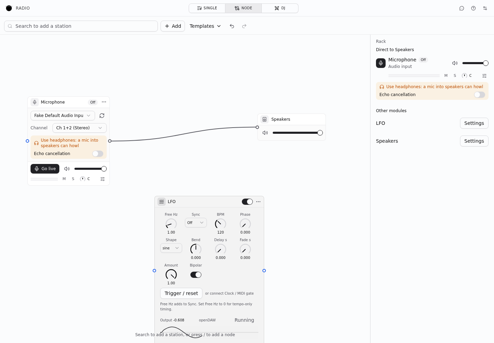
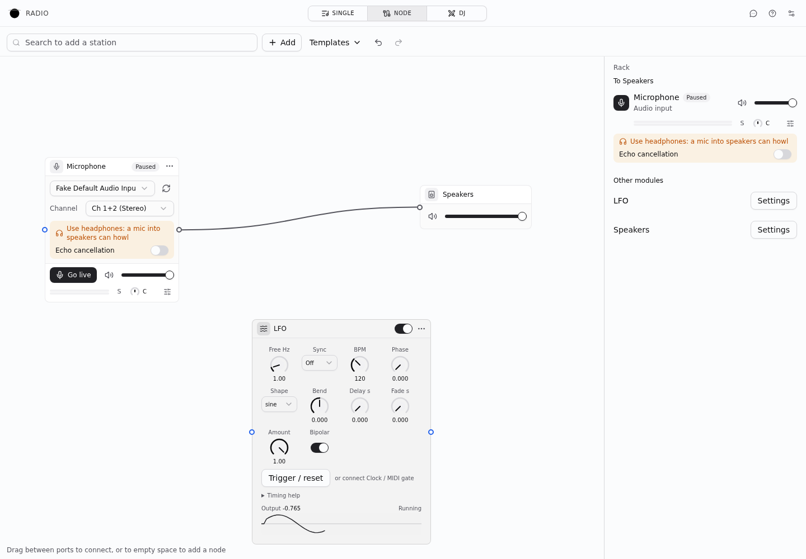
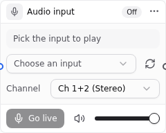
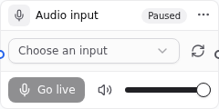
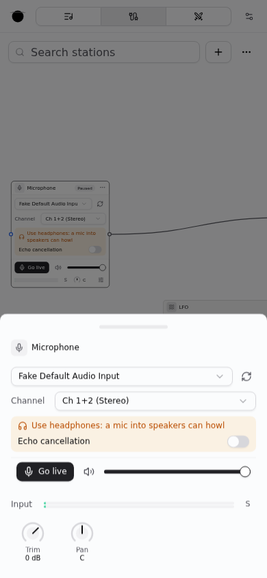

# Node mode UX validation, 10 October 2026

The pass preserves the existing typography, semantic colors, canvas layout and
inspector. It gives setup guidance one place to live, keeps one mute per source
surface, and describes playback separately from microphone permission.

| State | Before | After |
| --- | --- | --- |
| Input setup | Device hint repeats picker; channels appear before a device is selected | Picker leads; channels appear after selection |
| Input playback | Two controls say mute; badge says Off | Pause input changes playback; one volume mute; Starting / Live / Paused status |
| Routing | Rack says Direct even when effects intervene | Rack names the destination without implying a direct path |
| Modulation | Repeated engine label, timing paragraph and Running button | Engine on hover; expandable timing help; Running is status text |
| Templates | Replacing the patch is implicit | Replacement is stated before choosing a template |

## Screenshots

Chromium at 1440 × 1000, using the same microphone/LFO patch. The microphone is
Chromium's simulated device; these screenshots do not verify physical hardware.

| Before | After |
| --- | --- |
|  |  |
|  |  |

The 390 × 844 inspector uses the full drawer width, with one heading and one mute.

## Verification

- Chromium: Go live → Pause input → Go live, template replacement note,
  desktop canvas and phone inspector; no page errors or document overflow.
- Checked input setup in light and dark themes.
- Regression cases cover microphone-aware onboarding, loading guidance,
  Starting status, duplicate permission errors, and deferred channel controls.
- Audio routing, permission acquisition, capture lifetime and persistence are
  unchanged. Pausing input audio does not promise to release microphone access.
